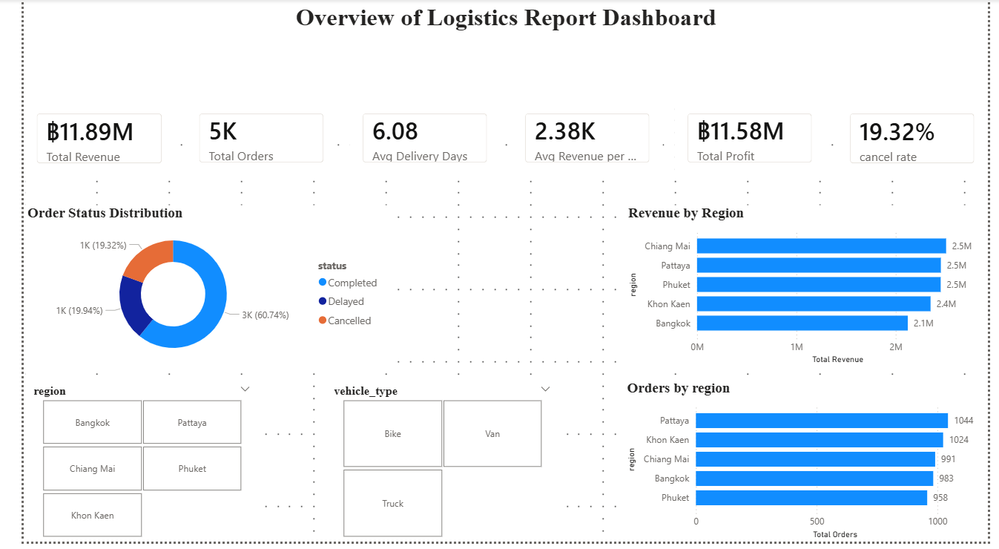
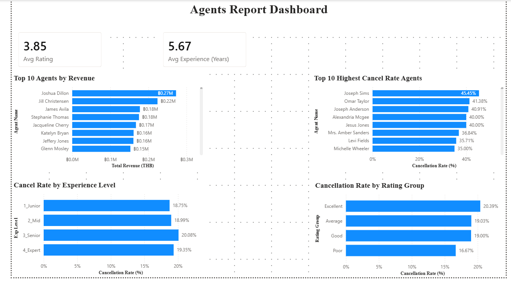

# 🚚 Logistics Performance Analysis

## Overview
Analysis of 5,000 logistics orders to identify 
cancellation patterns, delivery performance, 
and agent efficiency.

## Tools
- Python (Pandas, Seaborn, Matplotlib)
- Power BI
- SQL
- Jupyter Notebook
- SQLite

## Dataset
- Orders: 5,000 rows
- Agents: 220 agents

## Key Findings
- 🔴 Chiang Mai highest cancel rate (20.18%)
- 🚲 Bike delivery highest cancel rate (20.51%)
- 👤 Top agent: Joshua Dillon (฿270K revenue)
- 🏆 Top customer: CUST1412 (฿239K revenue)
- ⚠️ Agent Joseph Sims — 45.45% cancel rate

## Project Structure
- Logistic_Profile.ipynb — Data cleaning & EDA
- merge_with_agents.ipynb — Agent analysis
- Dashboard — Power BI report (PDF)

## Dashboard Preview
### Overview

### Agent Analysis

